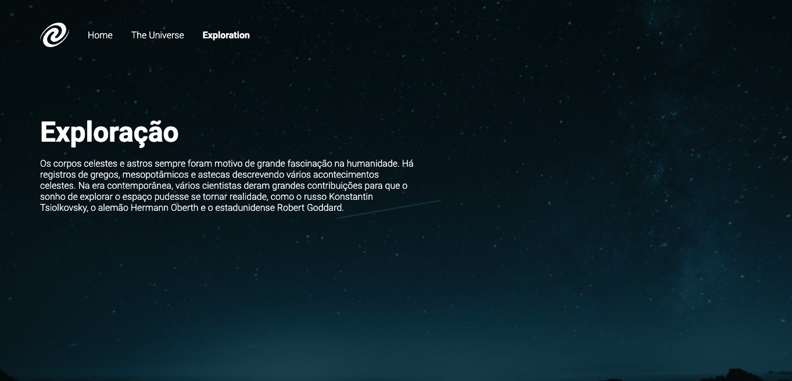

# spa-universe-phase-18

 <h1 align="center"> SPA Universe </h1>

  <a href="#-tecnologias">Tecnologias</a>&nbsp;&nbsp;&nbsp;|&nbsp;&nbsp;&nbsp;
  <a href="#-projeto">Projeto</a>&nbsp;&nbsp;&nbsp;|&nbsp;&nbsp;&nbsp;
  <a href="#-layout">Layout</a>&nbsp;&nbsp;&nbsp;|&nbsp;&nbsp;&nbsp;
  <a href="#memo-licença">Licença</a>

  

 

  

## 🚀 Tecnologias

Esse projeto foi desenvolvido com as seguintes tecnologias:

- HTML e CSS;
- JavaScript Assíncrono, Routes, DOM e SPA.

## 💻 Projeto

Projeto de uma SPA desenvolvido para solidificar os conceitos de rotas e JS Assíncrono

## 🔖 Layout

Você pode visualizar o layout do projeto através [desse link](https://matheusvaz-dev.github.io/spa-universe-phase-18).

## :memo: Licença

Esse projeto está sob a licença MIT.
